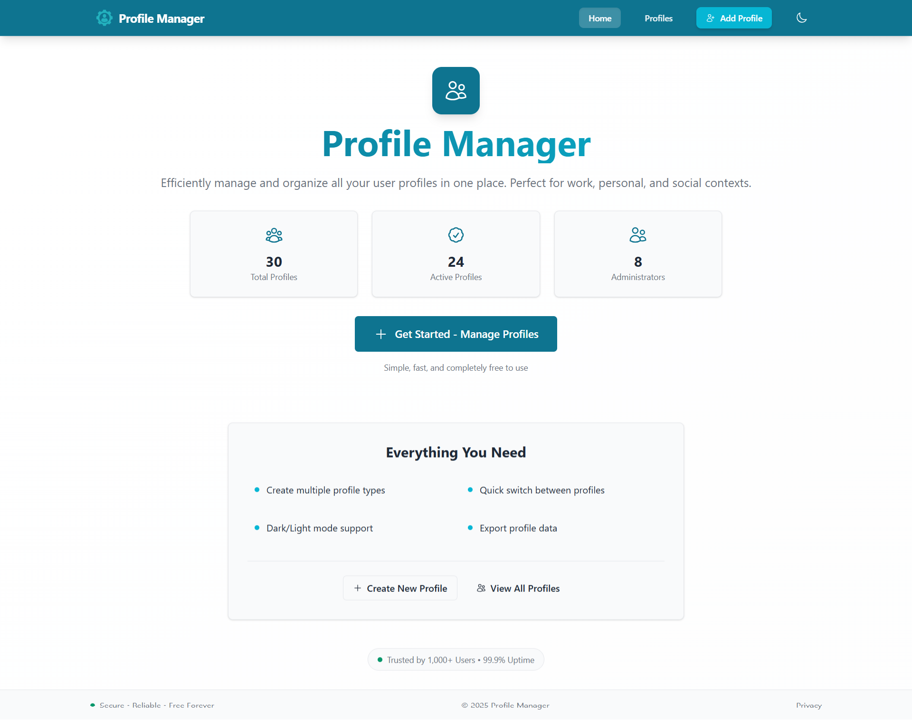
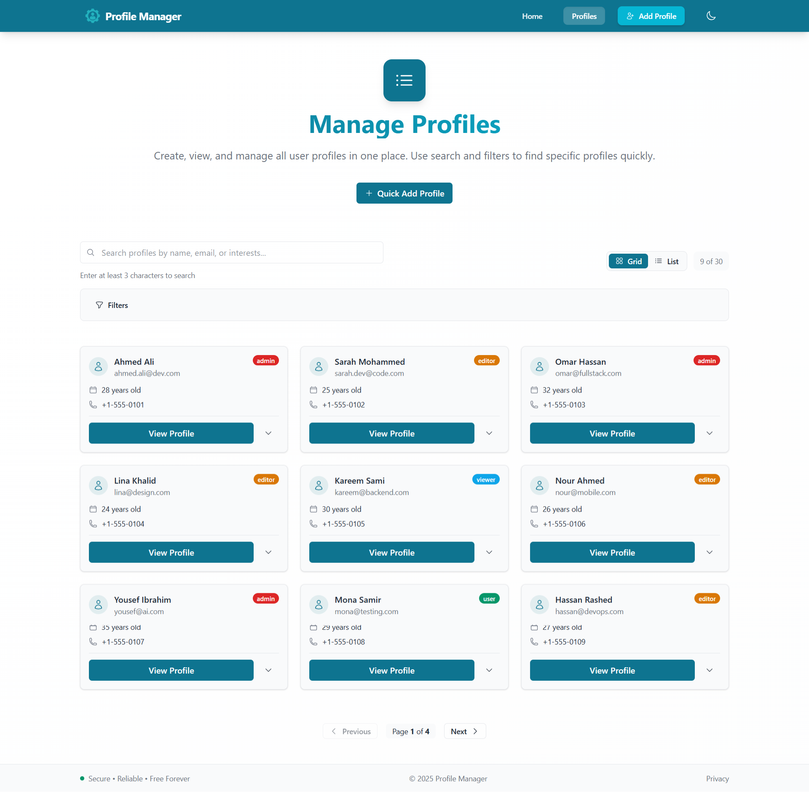
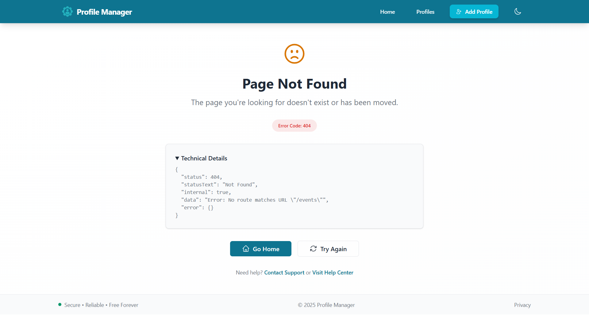
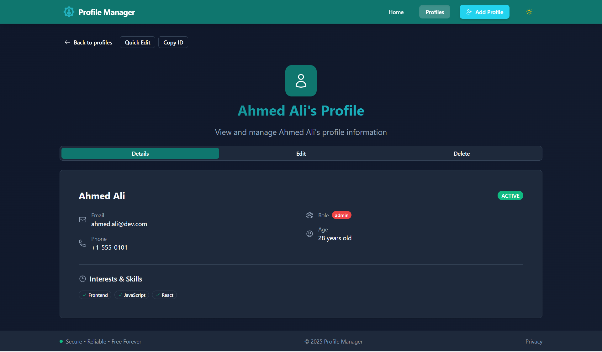
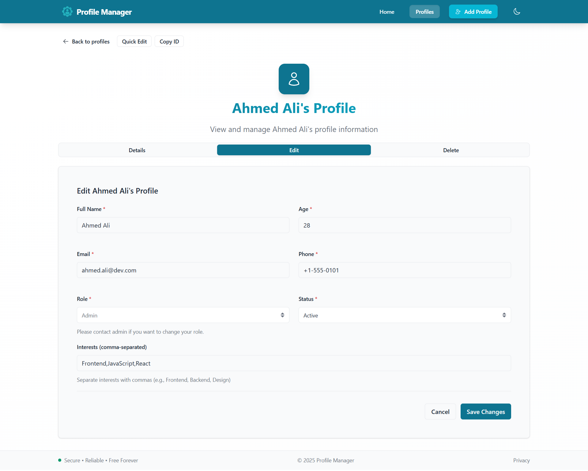
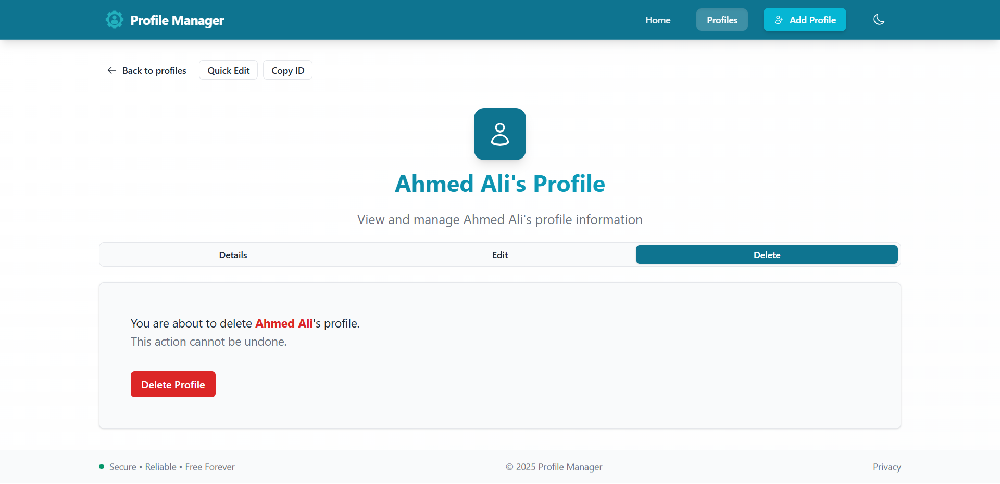
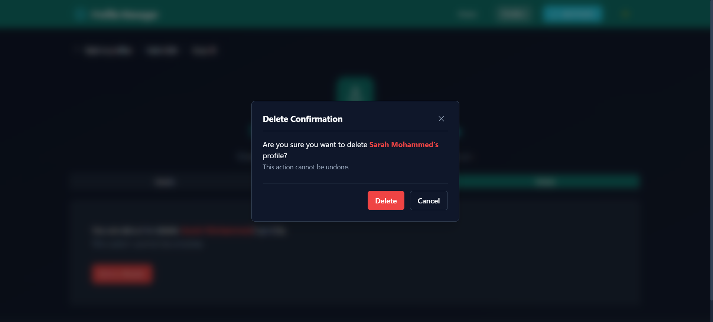
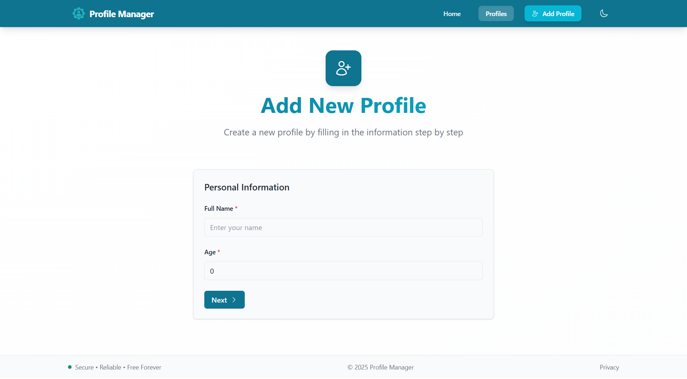
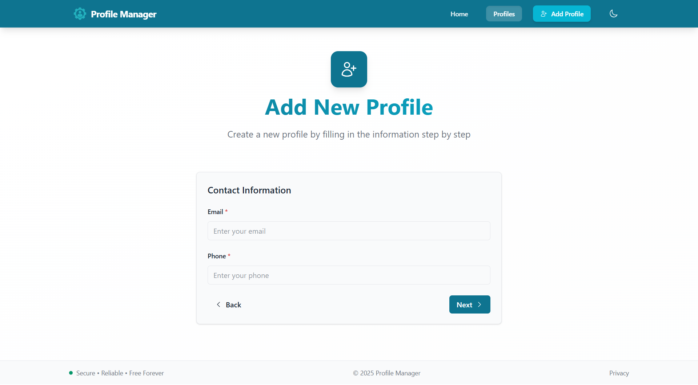

#  Profile Manager


A React + TypeScript application designed with **scalable architecture**, **reusable components**, and **real-world patterns**.

---

## 🏆 Key Achievements

- ✅ **Mastered Advanced React Patterns** – Built production-ready Compound Components, Render Props, and State Reducer systems.
- ✅ **Designed Scalable Architecture** – Feature-based structure with clean separation of concerns and reusable UI library.
- ✅ **Optimized Performance** – Smaller bundle size with code splitting, lazy loading, and memoization.
- ✅ **Type-Safe Development** – Generic components (like `SmartList<T>` and others) with full TypeScript integration for strong development.

---

## ✨ Overview

This profile manager represents my deep dive into **advanced React patterns** and **scalable architecture**. While building it, I focused on creating **reusable components**, organizing logic through **custom hooks**, and applying **React advanced patterns** commonly used in production environments. Special attention was given to **performance**, ensuring smooth rendering, efficient state updates, and fast navigation across the entire app.

### 🎯 Technical Focus

- **Applied advanced patterns** - Compound Components(Tabs, FormWizard), Render Props(Toggle), State Reducer for custom behavior and Controlled/Uncontrolled components(Modal)
- **Embraced TypeScript** for type safety development
- **Built custom hooks** to encapsulate and reuse complex logic
- **Implemented Context + Reducers** for predictable state
- **Performance-focused patterns** - minimizing unnecessary re-renders and ensuring efficient updates

### 🏗 Architecture Approach

- **Feature-based structure** for clarity and long-term maintainability
- **Shared UI library** used across the application
- **Clean separation** between UI, logic, and side effects
- **Performance-aware** rendering and state management
- **Production-inspired** patterns and decisions

---

## 🛠 Tech Stack

- **Core Development**: React 19, TypeScript, Vite
- **Styling & UI**: Tailwind CSS, Hero Icons
- **Routing & State**: React Router, Context API + useReducer
- **Advanced Patterns**: Compound Components, Render Props, State Reducer, Controlled/Uncontrolled components
- **Performance**: Code Splitting, Lazy Loading, Memoization

---

## 🚀 Key Features

### 👤 Profile Management

A **complete user management system** that covers every essential **CRUD** operation in real-world applications:

**Profile Creation:**

- **Quick Add**: Single-step form for fast creation
- **Form Wizard**: Guided multi-step process with validation

**Profile Operations:**

- **Browse**: Grid of profile cards with expandable sections
- **View**: Dedicated profile page with full details and tabs
- **Edit**: In-place editing (**Tab-based editing**) with real-time validation
- **Delete**: Safe deletion with confirmation modal

**State Management:**

- Global state via **Context API + useReducer**
- Predictable state updates
- Clean separation of concerns

**Usage:** \
Some Snippets code:

```tsx
// Quick Add Form
<ProfileForm onSuccess={handleSuccess} />

// Browse & View Profiles
<ProfileCard key={profile.id} profile={profile} />

//Profiles' state management
const { state, dispatch } = useProfileContext();

// Add profile
dispatch({
  type: "ADD_PROFILE",
  payload: { profile: newProfile } // newProfile: Profile
});

// Update profile
dispatch({
  type: "UPDATE_PROFILE",
  payload: { id: profileId, profile: updatedData }
});
```

---

### 🧭 Multi-Step Form Wizard

A **flexible, reusable wizard system** built with compound components:

**Architecture:**

- **Compound Components Pattern** for intuitive API
- **Context API + Reducer** for state management
- **TypeScript Generics** for type safety
- **Steps' Callback** for validation and side effects

**Features:**

- Dynamic step navigation (next/prev/callback-based transitions)
- Step-level validation callbacks
- Final submission with error handling
- Reusable across different item types (Profiles, Products, …)

**Usage:** \
Used to create a profile across multiple steps: Personal Info → Contact Info → Interests → Review → Submit

```tsx
//Flow: Personal Info → Contact Info → Interests → Review → Submit
<FormWizard<ProfileWizardState, ProfileWizardAction>
  context={ProfileWizardContext}
  reducer={profileWizardReducer}
  initialState={initialState}
  totalSteps={4}
>
  <FormWizard.Step>
    <StepPersonalInfo stepIndex={0} />
  </FormWizard.Step>
  <FormWizard.Step>
    <StepContactInfo stepIndex={1} />
  </FormWizard.Step>
  <FormWizard.Step>
    <StepInterests stepIndex={2} />
  </FormWizard.Step>
  <FormWizard.Step>
    <StepReview stepIndex={3} />
  </FormWizard.Step>
</FormWizard>
```

---

### 🔎 SmartList Component

A **generic, type-safe list component** for handling complex data collections.

**Core Features:**

- **Generic Type Support**: `SmartList<T>` works with any data type
- **Multiple Layouts**: Grid and list view modes via `GenericList` base
- **Advanced Search**: Debounced search across multiple fields
- **Dynamic Filtering**: Select and checkbox filters
- **Client-side Pagination**: Configurable page sizes

**Technical Implementation:**

- `useSearch<T>` hook
- `useDebouncedValue<T>` for debouncing search query
- `useFilter<T>` hook for multi-criteria filtering
- `usePagination<T>` hook for navigation
- **Internal components**: `<SmartListSearch />`, `<SmartListFilters />`, and `<SmartListPagination />` compose the final `SmartList<T>`
- Config-driven search and filter definitions
- State reducer pattern for custom behavior
- **Custom state management**: `useSmartListReducer` hook with default state reducer & `StateReducerOverride` for advanced behavior customization

**Usage Example:**
Used in **Profiles List page** to view all profiles with search, filter, pagination with results count.

```tsx
<SmartList<Profile>
  items={profiles}
  itemKey={(profile: Profile) => profile.id}
  renderItem={(profile: Profile) => (
    <ProfileCard key={profile.id} profile={profile} />
  )}
  pagination={{ pageSize: 9 }}
  search={searchConfig}
  filter={filterConfig}
/>
```

---

### 🧩 Tabs Component

A **flexible tab system** using the Compound Components pattern:

**Architecture & Key Features:**

- **Compound Components Pattern** for intuitive API
- **Context-driven with `useState`** for internal state management
- **TypeScript** for type safety
- **URL synchronization** for deep linking (Optional tab syncing with URL)
- Default tab support

**Usage Example:** \
Applied in **Profile View Page** to organize operations: View - Edit - Delete in one place

```tsx
//The main usage of the tabs system
<Tabs defaultTab="details">
  <Tabs.List>
    <Tabs.Tab tabName="details">Details</Tabs.Tab>
    <Tabs.Tab tabName="edit">Edit</Tabs.Tab>
  </Tabs.List>
  <Tabs.Container>
    <Tabs.Panel tabName="details">
      <ProfileDetails profile={profile} />
    </Tabs.Panel>
    {/* ... */}
  </Tabs.Container>
</Tabs>
```

---

### 🔘 Toggle Component

A **flexible state management** component using **Render Props + State Reducer** patterns.

**Key Features:**

- **useReducer hook** for local state management
- Default reducer + custom override support
- **TypeScript** for type safety
- Toggle, reset, and set state actions

**Usage Examples:**

1. **Toggling the Add Profile Section** (ProfileListPage)

```tsx
<Toggle>
  {({ on, toggle }) => (
    <section>
      <Button onClick={toggle} variant={on ? "outline" : "primary"}>
        {on ? "Cancel" : "Quick Add Profile"}
      </Button>
      {on && <ProfileForm onSuccess={toggle} />}
    </section>
  )}
</Toggle>
```

2. **Toggle Additional Content** (ProfileCard)

```tsx
<Toggle>
  {({ on, toggle }) => (
    <div>
      {on && <div>Additional details...</div>}
      <Button onClick={toggle} title={on ? "Show less" : "Show more"}>
        {on ? <ChevronUpIcon /> : <ChevronDownIcon />}
      </Button>
    </div>
  )}
</Toggle>
```

Note: The component supports custom reducers for advanced state logic as below:

```tsx
const customReducer: ToggleStateReducer = (state, action) => {
  //custom reducer logic
};

<Toggle reducer={customReducer}>
  {({ on, toggle }) => (
    // Custom toggle behavior
  )}
</Toggle>
```

---

### 🧱 Shared UI Components

A **comprehensive design system** of reusable components used throughout the application:

#### Some of these reusable components:

**Layout & Structure:**

- **`GenericList`** - Flexible list/grid layouts with empty state handling
- **`Grid`** - Responsive grid system (1-4 columns) with gap and max-width control

**Overlays & Feedback:**

- **`Modal`** - Controlled & uncontrolled modal dialogs
- **`LoadingIndicator`** - Loading states with multiple sizes and layouts

**Forms & Inputs:**

- **`Input`** & **`Select`** - Fully accessible form controls with labels, helper text, and error states
- **`Button`** - Multiple variants (primary, outline, ghost, success, danger) with multiple sizes & icons

**Data Display:**

- **`Card`** - Consistent container styling across the app
- **`Stat`** - Icon-value-label component for metrics display

---

### 🎨 Theme System

A **complete theme management system** with **dark/light mode** support, built with Context API and seamless TailwindCSS integration.

**Dark/Light mode Implementation Highlights:**

- **Theme Context** with `useState` for simple and effective state management
- Custom **`useTheme`** hook for easy access throughout the application
- Automatically adds/removes `dark` class from HTML element
- Triggers TailwindCSS dark mode variants automatically
- **Automatic persistence** in localStorage
- Provides visual feedback with smooth icon transitions
- Provides **ThemeToggle component** for using across app
- TypeScript support - fully typed for safe usage

**Usage Examples:**

1. Theme Provider Setup:

```tsx
// Wrap the entire application
createRoot(document.getElementById("root")!).render(
  <StrictMode>
    <ThemeContextProvider>
      <App />
    </ThemeContextProvider>
  </StrictMode>
);
```

2. Using ThemeToggle in Navigation:

```tsx
function Header() {
  return (
    <header>
      <nav>
        <NavLink to="/">Home</NavLink>
        <NavLink to="/profiles">Profiles</NavLink>
        <ThemeToggle /> {/* One-click theme switching */}
      </nav>
    </header>
  );
}
```

3. Accessing Theme in Components:

```tsx
function ThemedComponent() {
  const { theme } = useTheme();

  return (
    <div className={theme === "dark" ? "dark-styles" : "light-styles"}>
      Content that adapts to theme
    </div>
  );
}
```

---

## 📂 Project Architecture

A **feature-oriented React architecture** designed for scalability, clear separation of concerns, and reusable UI foundations.

### Layout System

- **Root Layout**: Application shell with global header, footer, and loading indicator.
- **Header**: Responsive navigation, theme toggle, and mobile drawer.
- **Error Page**: Friendly messaging, retry/navigation actions, and development-mode diagnostics.

### 📂 Project Structure Overview

A clean structure that scales easily and keeps features, shared logic, and UI patterns well-organized.

```text
src/
├── features/              → Core application features
│   ├── profile/           → CRUD, reducers, context, and multi-step wizard
│   └── theme/             → Theme system (light/dark) with context & hooks
│
├── shared/                → Reusable UI and logic
│   ├── components/        → Button, Card, Modal, Tabs, SmartList…
│   ├── hooks/             → search, filter, pagination…
│   ├── layouts/           → RootLayout, Header, Footer
│   └── types/             → Shared TypeScript types
│
├── pages/                 → Home, Profile List, Profile View, Add Profile
├── data/                  → Mock data
├── assets/                → Logos & static assets
└── router.tsx             → App routing configuration
```

---

## ⚡Performance Optimization

This project was designed with performance in mind from the start. Throughout development, I focused on **reducing bundle size**, **avoiding unnecessary re-renders**, and ensuring that every screen **feels fast and responsive**.

Below is a breakdown of the key techniques used in the application and why they matter.

### Highlights

- **Code Splitting:** Each page and heavy component is loaded on demand.
- **Lazy Loading + Suspense:** Routes and tabs load only when needed.
- **Prefetching:** Future steps and components are preloaded for instant navigation.
- **Memoization:** useMemo, useCallback, and React.memo reduce unnecessary re-renders.
- **Optimized Context:** Context values are memoized to avoid tree-wide updates.
- **Bundle Compression:** Gzip and Brotli versions are generated automatically.
- **Manual Chunk Splitting:** Dependencies are grouped into logical vendor chunks.
- **Bundle Analysis:** stats.html confirms improved structure and reduced duplication.

### What the Analysis Showed

- **Faster initial load** - Smaller initial bundle size
- **Instant navigation** - Prefetching and lazy loading
- **Optimized runtime** - Reduced unnecessary re-renders
- **Better caching** - Logical vendor chunk splitting

### Bundle Size:

- Total bundle size (uncompressed): 934.37 KB
- Gzip size: 200.60 KB
- Brotli size: 166.43 KB
- Total chunks: 11
- Total modules processed: 464
- Lazy-loaded files: 375 files

[View detailed performance analysis →](./docs/PERFORMANCE.md)

---

## ⚙️ Installation & Usage

Clone the repository, install project dependencies, and start the server

```bash
git clone git@github.com:smadi2512/profile-manager.git
cd profile-manager
npm install
npm run dev
```

**Note**: The project will run on http://localhost:5173

---

## 📸 Screenshots

<table align="center">
  <tr>
    <td>
      <h4 align="center">Home page</h4>
      
    </td>
    <td>
      <h4 align="center">Profiles page</h4>
      
    </td>
    <td>
      <h4 align="center">Error page</h4>
      
    </td>
  </tr>
  <tr>
    <td>
      <h4 align="center">Profile view with details tab/Dark Mode</h4>
      
    </td>
    <td>
      <h4 align="center">Profile view with edit tab</h4>
      
    </td>
    <td>
      <h4 align="center">Profile view with delete tab</h4>
      
    </td>
  </tr>
   <tr>
    <td>
      <h4 align="center">Profile view with confirm delete dialog/Dark Mode</h4>
      
    </td>
    <td>
      <h4 align="center">Profile Wizard with personal info step</h4>
      
    </td>
    <td>
      <h4 align="center">Profile Wizard with contact info step</h4>
      
    </td>
  </tr>
</table>

---

## 🧩 Future Improvements

- **Add advanced filtering**: date-based, range, and multi-select filters for profiles.
- Integrate **virtualized lists** (react-window) for large datasets
- Implement **optimistic UI updates** for instant feedback during profile operations.
- Add **drag-and-drop** for reordering profiles and interests
- Introduce **undo/redo functionality** using command pattern
- Build **plugin system** for extensibility and custom logic
- Enhance **accessibility and keyboard navigation** for a fully inclusive experience
- Add **unit/integration tests** (React Testing Library + Vitest)
- Implement **error logging & monitoring** (Sentry)

---

## 👩‍💻 Author

Created by **Walaa Smadi**✨ \
Passionate React developer building modern, maintainable, scalable, performant, and user-friendly web apps.

- Email: [walasmadi93@gmail.com](mailto:walasmadi93@gmail.com)
- LinkedIn: [Walaa Smadi](https://www.linkedin.com/in/walaa-bilal-smadi/)
- GitHub: [@smadi2512](https://github.com/smadi2512)

Feel free to fork, star ⭐, and contribute!
