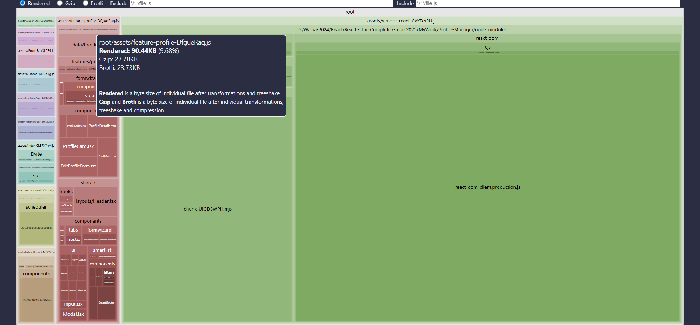

# ⚡ Performance Optimization

This project was designed with performance in mind from the start.
Throughout development, I focused on **reducing bundle size**, **avoiding unnecessary re-renders**, and ensuring that every **screen feels fast and responsive**.

Below is a breakdown of the key techniques used in the application and why they matter.

## 🛠 Optimization Techniques

### 🧩 Code Splitting & Lazy Loading

To keep the initial bundle small, all major pages and components are **lazy-loaded**.
This allows the browser to download only what is needed for the user’s current screen.

I used this technique in:

- Every route loads only when needed
- Profile pages use lazy-loaded tabs
- Wizard steps are loaded step-by-step
- Heavy components load on demand

#### Examples:

```tsx
//Main lazy-loaded route
const ProfileView = lazy(() => import("@/pages/profile/ProfileViewPage"));
<Suspense fallback={<LoadingIndicator />}>
  <ProfileView />
</Suspense>

//Lazy-loaded Form Wizard steps
<ProfileWizard totalSteps={4}>
  <Suspense fallback={<LoadingIndicator text="Loading Personal Info Step..." />}>
    <FormWizard.Step>
      <StepPersonalInfo stepIndex={0} />
    </FormWizard.Step>
  </Suspense>

  {/* all remaining steps in the same way */}

</ProfileWizard>
```

**Why this matters**: Code Splitting & Lazy Loading keeps the initial bundle light, improving first load speed and reducing the time users wait before seeing the UI.

---

### 🚀 Prefetching for Instant Navigation

Even with code splitting, a user may still experience a small delay the first time a lazily-loaded component is requested.

To solve this, I used **prefetching strategies** to load components before they’re needed.

1. Hover-Based Prefetching (Tabs) \
   Each tab triggers a dynamic import when the user hovers over it:

   ```tsx
   <Tabs.Tab
     tabName="details"
     onMouseEnter={() => import("@/features/profile/components/ProfileDetails")}
   >
     Details
   </Tabs.Tab>
   ```

   **Why it works:** By the time the user clicks the tab, the component is already downloaded — the interaction feels instant.

2. Predictive Prefetching (Form Wizard) \
   The multi-step wizard preloads upcoming steps as soon as the first step renders:

   ```tsx
   useEffect(() => {
     //Prefetch next steps
     void import(
       "@/features/profile/formwizard/components/steps/StepContactInfo"
     );
     void import(
       "@/features/profile/formwizard/components/steps/StepInterests"
     );
     void import("@/features/profile/formwizard/components/steps/StepReview");
   }, []);
   ```

   **Why it works:** When the user clicks “Next”, the next screen appears instantly with no loading delay.

#### 📌 Why Prefetching Matters

- Feels instant even though components are loaded on demand
- Reduces perceived waiting time
- Keeps initial bundles small
- Avoids showing loading indicators during common interactions

---

### 🧠 Memoization (useMemo, useCallback, memo)

I applied `useMemo`, `useCallback`, and `memo` to prevent unnecessary re-renders:

- `useMemo` for the derived state (e.g., selected profile)
- `useCallback` for callbacks passed to children (e.g. stable handlers in reducers and wizard logic)
- `memo()` for heavy UI components like profile cards
- Context values wrapped in `useMemo` to prevent subtree re-renders

#### Examples:

```tsx
//In ProfileViewPage
const selectedProfile = useMemo(() => {
  return state.profiles.find((profile) => profile.id === profileId);
}, [profileId, state.profiles]);


//In ProfileListPage
const renderProfile = useCallback(
  (profile: Profile) => <ProfileCard key={profile.id} profile={profile} />,
  []
);
<SmartList<Profile>
  items={profiles}
  itemKey={(profile: Profile) => profile.id}
  renderItem={renderProfile}
/>;


//For heavy components like: ProfileDetails
function ProfileDetails({ profile }: ProfileDetailsProps) {
  /* all code */
}
export default memo(ProfileDetails);
```

**Why this matters**: React re-renders less, updates smaller parts of the UI, and keeps the app responsive even with large lists.

#### 🪄 Optimized Context API Usage

Some state (profiles, theme, wizard, tabs state…) is stored in Context API + Reducers.

To avoid unnecessary renders:

- Context value is wrapped in `useMemo`
- Reducers stay stable via `useCallback`
- Components consuming context re-render only when needed

**Example:**

```tsx
const setActiveTab = useCallback(
  (tab: string) => {
    //Sync tab with URL logic here
  },
  [setSearchParams, syncWithUrl]
);
//Context value
const ctxValue = useMemo(
  () => ({ activeTab, setActiveTab }),
  [activeTab, setActiveTab]
);
//Context Provider
<TabsContext.Provider value={ctxValue}>{children}</TabsContext.Provider>;
```

**Why this matters**: This leads to predictable, efficient state updates.

---

### 🚀 Manual Vendor Splitting (Vite manualChunks)

Specific packages are split into their own chunks in `vite.config.ts`:

```ts
//Vendor Splitting
if (id.includes("node_modules")) {
  if (id.includes("react")) return "vendor-react";
  if (id.includes("react-router")) return "vendor-router";
  if (id.includes("@heroicons")) return "vendor-icons";
  if (id.includes("clsx") || id.includes("uuid")) return "vendor-utils";

  //everything else in node_modules
  return "vendor-other";
}
```

#### Why It Matters

- Better browser caching
- Smaller incremental updates
- Reduced re-downloads
- Smaller initial chunks

---

### 🚀Feature-Level Code Splitting

Each feature folder becomes a dedicated chunk:

```ts
//Feature-based Splitting
if (id.includes("/src/features/")) {
  const match = id.match(/\/src\/features\/([^\\/]+)/);
  if (match) {
    return `feature-${match[1].toLowerCase()}`;
  }
}
```

#### Why It Matters

Users load only the feature they interact with—nothing more.

---

### 🫙 Bundle Compression (Gzip + Brotli)

The build process automatically generates:

- .gz compressed files
- .br (Brotli) compressed files

Using:

```ts
compress({
  algorithm: "gzip",
  ext: ".gz",
});

compress({
  algorithm: "brotliCompress",
  ext: ".br",
});
```

#### Why this matters

- Automatically generates `.gz` and `.br` versions during build.
- Reduces transfer size by **70–90%**.
- Brotli usually reduces file size by an additional 15–25% compared to gzip.
- Browsers pick the best format automatically.

---

### 🚀 Minification & Target Optimization

Using fast ESBuild minification:
```ts
minify: "esbuild",
target: "esnext"
```

#### Why It Matters
- Faster builds
- Smaller bundles
- Fewer polyfills → less JavaScript

---
## 📦 Final Build Output

After I applied all optimizations, the project now ships highly optimized bundles.

### Bundle Size Overview
*(I extracted from the latest `stats.html` build)*

- Total bundle size (uncompressed): 934.37 KB
- Gzip size: 200.60 KB
- Brotli size: 166.43 KB
- Total chunks: 11
- Total modules processed: 464
- Lazy-loaded files: 375 files


> These sizes reflect the optimized state of the application after I applyed code splitting, memoization, prefetching, and compression.


---

## 📊 Bundle Visualization

I used **rollup-plugin-visualizer** to inspect bundle composition and ensure
that code splitting and vendor extraction work as expected.




---

## 🧹 Tree Shaking & Dead Code Elimination

Vite (powered by ESBuild and Rollup) automatically removes unused code during the build.
This includes:

- Unused exports from modules
- Unused utility functions
- Development-only code
- Unused icons from Heroicons package
- Unused React internals

**Result:** Only the code that is actually used makes it into the final bundle, reducing download and parse time.


---

## 🎛 Runtime Rendering Optimization

To avoid unnecessary rendering, several techniques are applied:

- **React.memo()** on heavy or frequently rendered components
- **useCallback** to stabilize function references passed to children
- **useMemo** to compute expensive derived values
- **Context values wrapped in useMemo** to prevent context-driven re-renders
- **Derived state** instead of storing duplicated state values

These optimizations ensure smooth UI updates even with large lists and complex components.

---

## 📥 Network Delivery Optimization

The build process outputs compressed assets using:

- **Gzip**
- **Brotli (br)**

Brotli provides the smallest asset size and is supported by all modern browsers.
If a browser doesn’t support Brotli, it falls back to Gzip automatically.

**Result:** Faster transfer times and lower data usage, especially on mobile networks.

---

## 🧭 Perceived Performance

Some optimizations don’t change bundle size but improve the *feel* of performance:

- **Suspense fallback loaders** give immediate visual feedback
- **Prefetching** makes next screens feel instantaneous
- **Transitions & smooth loading** hide expensive operations
- **Progress indicators** for slow network conditions

**Result:** These small touches make the app feel faster even when network speed is slow.

---

## 🔮 Future Performance Improvements

While the current build is optimized, there are additional techniques that can be added later:

- Component-level virtualization using `react-window`
- Server-side rendering (SSR) with hydration
- Prefetching profiles list depending on viewport intersection


